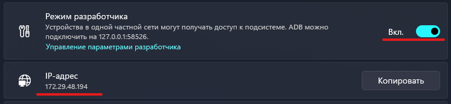
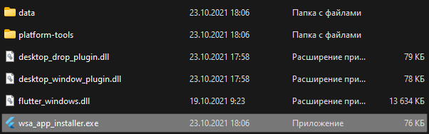
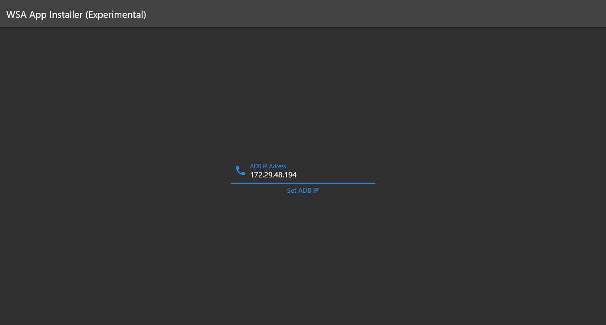
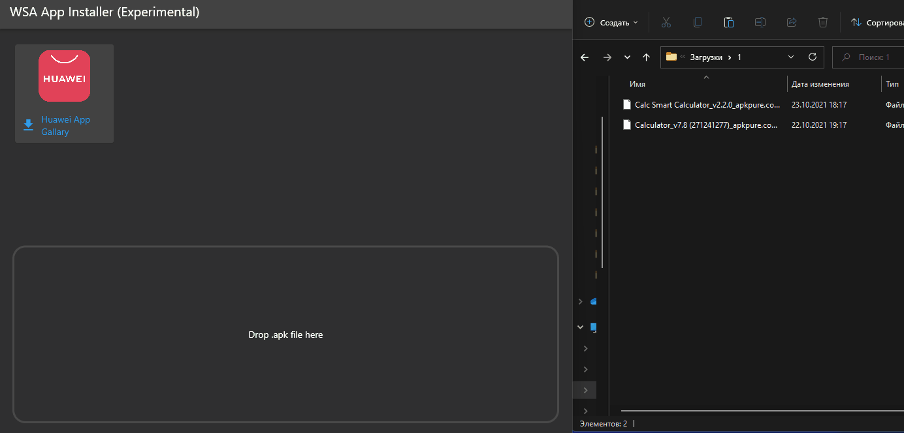

# wsa_app_installer

!> Attention! Does not need to be pinned high hopes. it's just an experiment for fun.

- [download the latest release](https://github.com/maxnemoy/wsa_app_installer/releases/download/exp_rls/wsa_installer.zip)
- unpack the zip archive
- start WSA, turn on developer mode and copy the IP address

- run wsa_app_installer.exe

- insert the IP address and click "Set"

- drag the apk file (or install HuaweiAppGallery)

## Getting Started

This project is a starting point for a Flutter application.

A few resources to get you started if this is your first Flutter project:

- [Lab: Write your first Flutter app](https://flutter.dev/docs/get-started/codelab)
- [Cookbook: Useful Flutter samples](https://flutter.dev/docs/cookbook)

For help getting started with Flutter, view our
[online documentation](https://flutter.dev/docs), which offers tutorials,
samples, guidance on mobile development, and a full API reference.
